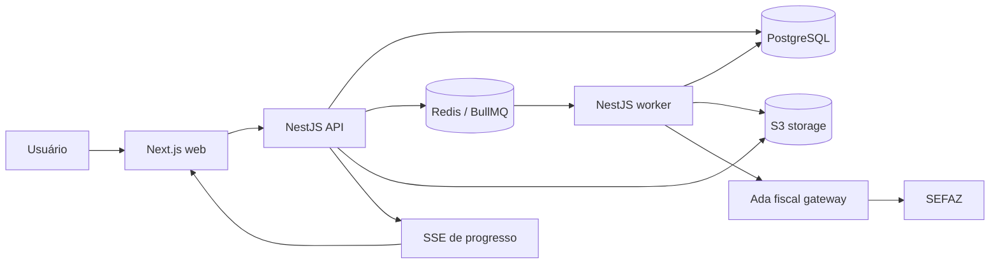
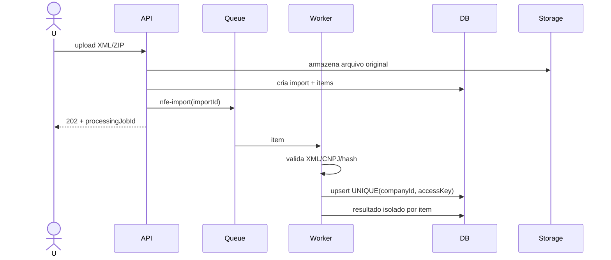
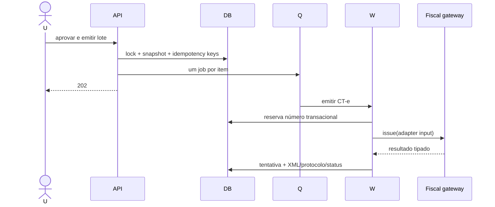
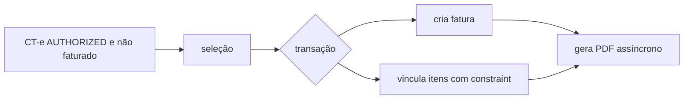

# Arquitetura recomendada

## Decisão

Monólito modular em monorepo, implantado como três serviços. Evita o custo
operacional de microsserviços no MVP sem misturar processos HTTP, jobs e UI.

## Tecnologias

| Área | Escolha | Motivo | Alternativa/risco |
| --- | --- | --- | --- |
| Runtime | Node.js LTS + TypeScript | ecossistema do pacote Ada | Bun após compatibilidade comprovada |
| Monorepo | pnpm + Turborepo | cache e workspaces simples | Nx, mais governança |
| API/worker | NestJS | módulos, DI, OpenAPI e workers | Fastify puro, menos estrutura |
| Web | Next.js + React | painel produtivo e SSR opcional | Vite SPA |
| UI | Tailwind + shadcn/ui | acessível e customizável | MUI |
| Banco | PostgreSQL | transações, constraints, JSONB | nenhum substituto recomendado |
| ORM | Prisma | migrations e tipos | Drizzle |
| Fila | BullMQ + Redis | retry, backoff e concorrência | pg-boss |
| Storage | S3 interface | Railway bucket e MinIO local | volume, não recomendado |
| Auth | Keycloak/OIDC via adapter | RBAC e multiempresa | Auth.js + IdP |
| Validação | Zod nos contratos; DTO pipes | contratos compartilháveis | class-validator |
| API docs | OpenAPI 3.1 | contrato e geração de cliente | tRPC, acoplamento maior |
| Logs/traces | Pino + OpenTelemetry | correlação e baixo overhead | Winston |
| Testes | Vitest, Testcontainers, Playwright | pirâmide completa | Jest |
| Deploy | Railway | ambientes e serviços gerenciados | Kubernetes, prematuro |

## Limites modulares

`identity`, `companies`, `nfe-imports`, `nfe-documents`, `freight`,
`cte-batches`, `cte-documents`, `billing`, `processing`, `storage`, `audit`.
Módulos comunicam por casos de uso e eventos internos, nunca acessando tabelas
alheias diretamente.

## Fluxos principais

SSE será usado para progresso, com polling controlado como fallback.
