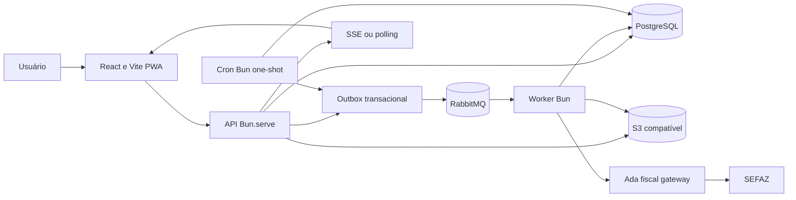

# Arquitetura vigente

## Decisão

O TransportAdA é um monorepo de aplicações separáveis. O repositório facilita o
desenvolvimento conjunto, mas web, API, worker e cron possuem composition root,
dependências, scripts, artefato e ciclo de deploy próprios. Nenhuma aplicação
importa código-fonte de outra.



O cron não fala com o broker nem com o SEFAZ: ele grava a mesma linha de
importação que a API gravaria e deixa o outbox e o worker seguirem o caminho de
sempre. Um trilho a menos para divergir.

## Tecnologias

| Área              | Escolha                          | Regra                                            |
| ----------------- | -------------------------------- | ------------------------------------------------ |
| Runtime e pacotes | Bun com versão fixada            | Também executa testes e scripts                  |
| Monorepo          | Bun workspaces                   | Raiz apenas orquestra apps independentes         |
| API               | `Bun.serve` + Zod + OpenAPI      | uWebSockets é interno ao Bun; sem addon V8       |
| Worker            | Bun + consumidor RabbitMQ        | Manual ack, prefetch, retry, DLX e DLQ           |
| Cron              | Bun one-shot + advisory lock     | Um ciclo por execução; sem agendador embutido    |
| Web               | React + Vite + `shadcn/ui`       | SPA/PWA; sem SSR no MVP                          |
| Estado remoto web | TanStack Query                   | Sem fetch manual em `useEffect`                  |
| UI                | tokens, i18n e `shadcn/ui`       | mobile-first; sem textos/cores soltos            |
| Banco             | PostgreSQL + Drizzle/Bun SQL     | migrations versionadas pelo Drizzle Kit          |
| Fila              | RabbitMQ                         | jobs fiscais são críticos; BullMQ não é o padrão |
| Storage           | interface S3                     | MinIO local; bucket gerenciado apenas após gates |
| Auth              | `@adatechnology/keycloak-jwt`    | tenant derivado do token                         |
| Fiscal            | `@adatechnology/fiscal-provider` | somente exports públicos via gateway             |
| Logs              | `@adatechnology/logger`          | redaction e correlação obrigatórias              |
| Testes            | `bun test` e Playwright          | integração real para banco e broker              |
| Deploy            | Railway depois dos gates locais  | nenhuma promoção automática                      |

Next.js não traz benefício proporcional para o painel autenticado atual: não
há requisito de SEO, SSR, Server Components ou BFF no frontend. Vite reduz
runtime, build e acoplamento. Next.js só será reconsiderado por ADR se surgir
um requisito concreto dessas capacidades.

## Ownership de código

```text
transportada/
├── apps/
│   ├── api-transportada/
│   ├── worker-transportada/
│   ├── cron-transportada/
│   └── frontend-transportada/
├── docs/
├── specs/
├── compose.yaml
└── Makefile

adatechnology-packages/
└── packages/
    ├── backend/
    │   ├── fiscal-provider/
    │   ├── logger/
    │   ├── keycloak-jwt/
    │   ├── drizzle-provider/       # se aprovado na task correspondente
    │   └── rabbitmq-provider/      # se aprovado na task correspondente
    └── frontend/
```

Código exclusivo de uma aplicação permanece nela. Uma abstração só vira
biblioteca Ada quando há consumo entre aplicações ou reuso comprovado. Código
compartilhado usa pacote publicado e versionado; `workspace:*`, `file:` e
imports relativos entre repositórios não entram em manifests commitados.

### Regra duplicada por cópia: elegibilidade da busca automática

A regra que decide se uma empresa pode ter notas buscadas automaticamente vive
duas vezes: `api-transportada/src/companies/domain/distribution-eligibility.policy.ts`
responde "por que está bloqueado" para a tela, e
`cron-transportada/src/nfe-distribution-pull/domain/distribution-eligibility.policy.ts`
decide o descarte no ciclo. É cópia deliberada — a alternativa seria publicar um
pacote Ada por uma policy de trinta linhas, ou fazer o cron chamar a API, o que
acopla o agendado ao HTTP para nada.

O preço é o de sempre: mudar de um lado e esquecer o outro faz a tela prometer
uma busca que o cron descarta. Dois contratos seguram isso — a paridade do corpo
servido pelas duas rotas da API
(`test/companies/scheduled-distribution-parity.contract.ts`) e o vocabulário de
razões no cron (`test/nfe-distribution-pull/eligibility-reasons.contract.ts`).
Quando houver um terceiro consumidor, a cópia deixa de se pagar e vira pacote.

## Dados e concorrência

- migrations nunca executam implicitamente no startup;
- dinheiro usa `numeric(19,4)` e percentuais `numeric(9,6)`, tratados como
  string/Decimal;
- uniques de negócio incluem `companyId` quando a regra é por empresa;
- API grava estado e outbox na mesma transação;
- worker confirma a mensagem somente após o commit do efeito;
- envelopes, exchanges e routing keys são versionados;
- dois consumidores fiscais de versões incompatíveis nunca operam juntos.

## Limites modulares

`identity`, `companies`, `nfe-imports`, `nfe-documents`, `freight`,
`cte-batches`, `cte-documents`, `billing`, `processing`, `storage` e `audit`.
Módulos comunicam por casos de uso e eventos, sem acessar tabelas alheias
diretamente.

## Frontend

O frontend é publicável como artefato estático e configurado por
`VITE_API_URL`. Deve nascer com:

- módulos por domínio e sufixos de arquivo definidos nas regras;
- TanStack Query para dados remotos;
- `shadcn/ui` como base obrigatória de componentes visuais;
- `react-i18next` e arquivos `*.locale.json`;
- design tokens sem valores visuais arbitrários em componentes;
- manifest, service worker e fallback offline;
- verificação visual em 375 px, 768 px e 1280 px;
- nenhum token sensível em `localStorage`.

## Fluxos principais

Importação, emissão e faturamento continuam conforme o domínio documentado. A
API responde rapidamente e agenda efeitos pesados; o worker concentra
integrações fiscais. SSE pode informar progresso, com polling controlado como
fallback.
