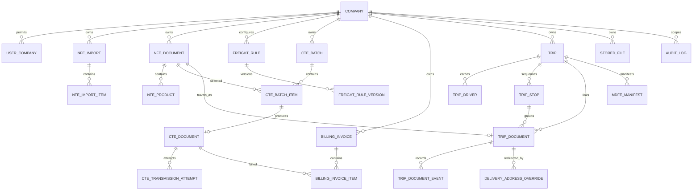

# Modelo de domínio e integridade

## Identidades fiscais e papéis (quem é quem por CNPJ)

Regra central do produto — vale para toda importação de NF-e e emissão de CT-e.

- **Nossa empresa = a transportadora (transportador/carrier).** É o tenant
  (`company`). Tem um CNPJ próprio, que é o mesmo do **certificado digital**
  usado para assinar os CT-e. _Exemplo:_ `61156864000191` (AFR FERNANDES).
- **Cliente = o emitente da NF-e.** É quem vende a mercadoria e emite a nota;
  cada cliente tem seu próprio CNPJ, que **varia de nota para nota**.
  _Exemplo:_ `05868574001090` (COMERCIAL ZARAGOZA).
- **O vínculo:** na NF-e do cliente, a **nossa transportadora** aparece como
  **transportador**. É isso que liga a nota à nossa empresa e nos autoriza a
  transportar aquela carga.

### Fluxo

```
NF-e do cliente (emitente = cliente, transportador = nós)
  → importa para o TransportAdA
  → agrupa em lote (CteBatch)
  → emite CT-e do frete (assinado com o certificado da transportadora)
```

### Invariante inegociável

O CNPJ do perfil fiscal da empresa (`company_fiscal_profiles.cnpj`) **é sempre
o CNPJ da nossa transportadora** e **deve ser igual** ao
`digital_certificates.validated_cnpj` do certificado ativo. Nunca é o CNPJ do
emitente da nota.

- O CNPJ do **emitente** (`nfe_participants.tax_id`, role `emitter`) é dado do
  **cliente** e legitimamente difere do nosso — não é erro, não deve ser
  "corrigido".
- Confundir os dois — salvar o CNPJ do cliente no perfil da empresa — quebra a
  emissão de CT-e, porque o CNPJ do perfil não bate com o certificado que
  assina o documento. A tela de configurações deve **bloquear** salvar um CNPJ
  diferente do certificado ativo (mesma validação já aplicada na troca de
  certificado em `digital-certificate-rotation.service.ts`).

## Agregados

- Company: configurações, certificado, ambiente e sequências.
- NfeImport: itens e resumo de processamento.
- NfeDocument: partes, endereços, produtos e arquivo original.
- FreightRule: versões vigentes; FreightCalculation guarda snapshot.
- CteBatch: itens, aprovação, cálculo e emissão.
- CteDocument: eventos e tentativas de transmissão.
- BillingInvoice: itens, totais e eventos.
- Trip: paradas ordenadas, condutores e documentos vinculados, com estado próprio (ADR-0043).
- TripStop: uma parada por endereço de entrega distinto; agrupa as notas daquele endereço.
- DeliveryClient: **o destinatário com identidade própria** (spec 060). Chave `(company_id, tax_id)`,
  nasce sozinho na importação da NF-e com identidade e **sem regra** — janela, taxa esperada e
  agendamento obrigatório são preenchidos à mão só por quem os tem (ADR-0048). Guarda o que afeta a
  entrega, não o relacionamento comercial: isto **não é CRM**.
- Contractor: **o embarcador que contratou o frete** — o emitente da nota, pelo mesmo caminho
  automático. Guarda o período de fechamento e para quem o relatório de repasse vai.
- DeliveryClientWindow e DeliveryClientException: a hora em que o cliente recebe. A janela é lista
  (o almoço fechado é um buraco entre dois intervalos), e a exceção é a data que foge da semana.
- MunicipalHoliday: `(company_id, city_ibge_code, holiday_on)`. O feriado é **da cidade**, não do
  cliente — e a exceção do cliente vence o feriado, para o CD que trabalha no feriado não sumir do
  roteiro justamente no dia em que é o único aberto.
- TripStopSchedule: o agendamento da parada — um por parada, e ele **bloqueia o despacho** enquanto
  estiver pendente ou recusado. O protocolo viaja até o motorista: um agendamento que o sistema
  conhece e ele não é um agendamento que não existe.
- DeliveryCharge: a taxa que o cliente cobrou de verdade, com estado próprio
  (`suggested → recorded → submitted → approved | rejected → reimbursed`). `contractor_id` anulável:
  taxa de nota cujo emitente ainda não tem cadastro existe e aparece como "sem contratante".
- DeliveryClientChargeRule: a taxa que se repete, como **regra** — ela propõe, quem lança é gente.
- ExtraChargeBatch: o lote de repasse, **do contratante e do período** (nunca da viagem), com o token
  opaco da página pública de aprovação (ADR-0048 §7).
- TripFinancialResult: **a conta da viagem, congelada quando ela fecha** (ADR-0049). Receita de CT-e
  autorizado, imposto que desce dela e custo por parcela — cada parcela com `source`
  (`measured` · `estimated` · `missing` · `period`), porque parcela ausente que vira zero produz
  margem que engana com confiança. Recalcular gera versão nova, com motivo; a anterior fica.
- TripCostEntry: pedágio e gasto avulso lançados na viagem.
- CompanyTaxSettings: o regime federal e as alíquotas de PIS/COFINS. Sem ele a margem sai marcada
  como "sem os federais" — assumir um regime erraria em silêncio, com cara de número certo.
- ProcessingJob e AuditLog: rastreabilidade transversal.



## Constraints mínimas

- `nfe_document(company_id, access_key)` unique.
- `cte_document(company_id, idempotency_key)` unique.
- `fiscal_sequence(company_id, environment, model, series)` unique.
- item ativo de faturamento por CT-e protegido por índice unique parcial.
- versões de regra não se sobrepõem para o mesmo escopo/prioridade.
- FK compostas ou validação equivalente impedem relação entre tenants.
- `numeric(19,4)` para valores; percentual `numeric(9,6)`.
- `trip_stop(trip_id, sequence)` unique.
- índice unique parcial garante que uma NF-e viva esteja em no máximo uma viagem.
- ordem das paradas imutável a partir de `dispatched` (ADR-0043 §2).

## Estados

| Agregado    | Estados                                                                                                                   |
| ----------- | ------------------------------------------------------------------------------------------------------------------------- |
| Import      | PENDING, PROCESSING, PARTIALLY_PROCESSED, COMPLETED, FAILED, CANCELLED                                                    |
| Import item | PENDING, VALIDATING, IMPORTED, DUPLICATED, INVALID, REJECTED, FAILED                                                      |
| Batch       | DRAFT, CALCULATING, CALCULATED, PENDING_APPROVAL, APPROVED, PROCESSING, PARTIALLY_PROCESSED, COMPLETED, FAILED, CANCELLED |
| CT-e        | DRAFT, PENDING, QUEUED, PROCESSING, AUTHORIZED, REJECTED, DENIED, CANCEL_PENDING, CANCELLED, FAILED                       |
| Invoice     | DRAFT, OPEN, ISSUED, PARTIALLY_PAID, PAID, OVERDUE, CANCELLED                                                             |
| Job         | PENDING, PROCESSING, SUCCEEDED, RETRY_SCHEDULED, FAILED, DEAD_LETTER, CANCELLED                                           |
| Trip        | DRAFT, ROUTE_PLANNED, SEPARATING, LOADING, DISPATCHED, IN_TRANSIT, COMPLETED, CANCELLED                                   |
| Trip doc    | PENDING, SEPARATED, LOADED, DELIVERED, RETURNED                                                                           |

O estado da viagem é **derivado** do das notas, exceto em quatro transições manuais
(`route_planned`, `dispatched`, `cancelled`, e a criação em `draft`) — ADR-0043 §1. `DISPATCHED` é
irreversível e sela o vínculo de documentos (§2).

Transições inválidas retornam `409 STATE_TRANSITION_NOT_ALLOWED` e são
auditadas.
