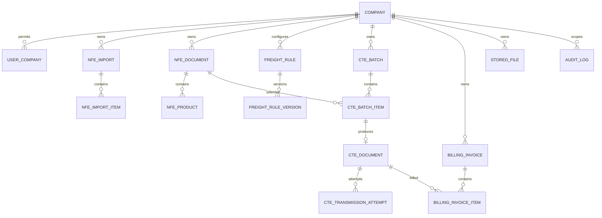

# Modelo de domínio e integridade

## Agregados

- Company: configurações, certificado, ambiente e sequências.
- NfeImport: itens e resumo de processamento.
- NfeDocument: partes, endereços, produtos e arquivo original.
- FreightRule: versões vigentes; FreightCalculation guarda snapshot.
- CteBatch: itens, aprovação, cálculo e emissão.
- CteDocument: eventos e tentativas de transmissão.
- BillingInvoice: itens, totais e eventos.
- ProcessingJob e AuditLog: rastreabilidade transversal.

## Constraints mínimas

- `nfe_document(company_id, access_key)` unique.
- `cte_document(company_id, idempotency_key)` unique.
- `fiscal_sequence(company_id, environment, model, series)` unique.
- item ativo de faturamento por CT-e protegido por índice unique parcial.
- versões de regra não se sobrepõem para o mesmo escopo/prioridade.
- FK compostas ou validação equivalente impedem relação entre tenants.
- `numeric(19,4)` para valores; percentual `numeric(9,6)`.

## Estados

| Agregado    | Estados                                                                                                                   |
| ----------- | ------------------------------------------------------------------------------------------------------------------------- |
| Import      | PENDING, PROCESSING, PARTIALLY_PROCESSED, COMPLETED, FAILED, CANCELLED                                                    |
| Import item | PENDING, VALIDATING, IMPORTED, DUPLICATED, INVALID, REJECTED, FAILED                                                      |
| Batch       | DRAFT, CALCULATING, CALCULATED, PENDING_APPROVAL, APPROVED, PROCESSING, PARTIALLY_PROCESSED, COMPLETED, FAILED, CANCELLED |
| CT-e        | DRAFT, PENDING, QUEUED, PROCESSING, AUTHORIZED, REJECTED, DENIED, CANCEL_PENDING, CANCELLED, FAILED                       |
| Invoice     | DRAFT, OPEN, ISSUED, PARTIALLY_PAID, PAID, OVERDUE, CANCELLED                                                             |
| Job         | PENDING, PROCESSING, SUCCEEDED, RETRY_SCHEDULED, FAILED, DEAD_LETTER, CANCELLED                                           |

Transições inválidas retornam `409 STATE_TRANSITION_NOT_ALLOWED` e são
auditadas.
